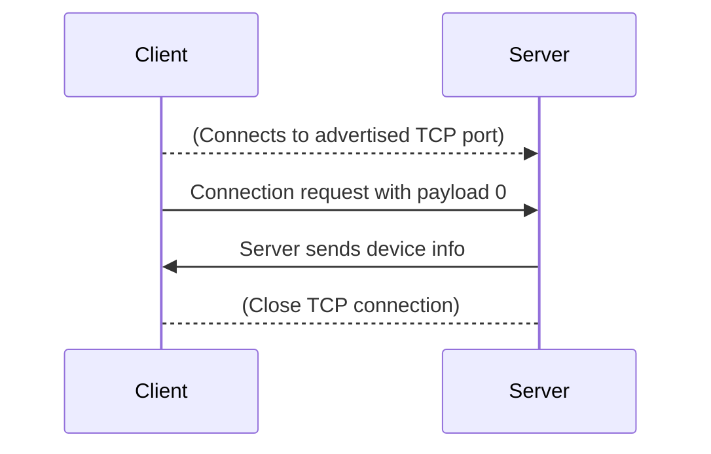
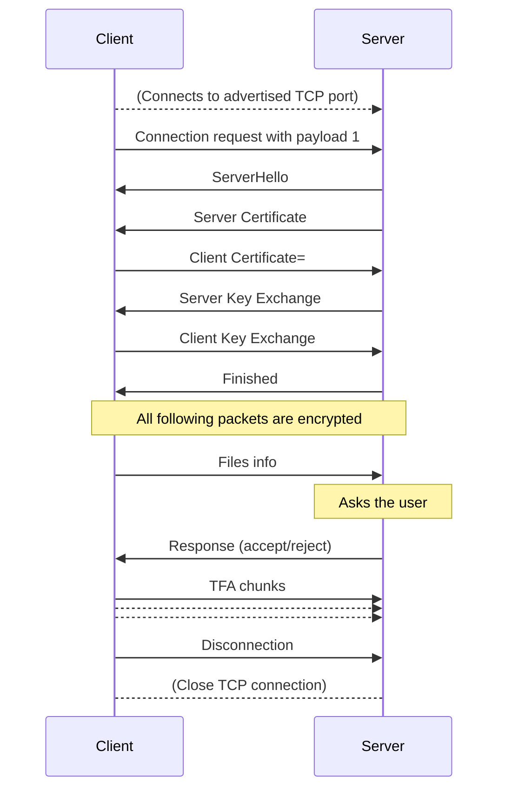

# Protocol

The protocol is peer-to-peer, end-to-end encrypted.

### Device roles

Since a file transfer is unidirectional, the peers are assigned roles:

* The receiving side is the **server**. It listens on a TCP port and advertises an mDNS service.
* The sending side is the **client**. It discovers the mDNS service and connects to the server's TCP port.

### How devices find each other

To become visible for other devices, a *server* advertises an mDNS service. The **domain** is `local.`. The **type** is `_flowdrop._tcp.`. The **port** is an arbitrary TCP port on which the server accepts incoming connections.

The **name** is a 12-character string. Basically, it is generated by encrypting the current UNIX time in MD5

The service also needs to have a TXT record with key `v` and the value of the specification version: `0`

Also, if the device does not support IPv6 (for example Android), the service must have a TXT record `ipf=4`

Device Info is a json object with the following parameters:
- `id` Cannot be null, must be same with mDNS service name.
- `name` Changeable device name.
- `model` Device Model.
- `platform` Operating system distribution.
- `system_version` Operating system distribution version.

[Read more about Device Info](device_info.md)

### How files are transferred

The [TFA](https://github.com/noseam-env/libvirtualtfa) archive format has been developed for this purpose

